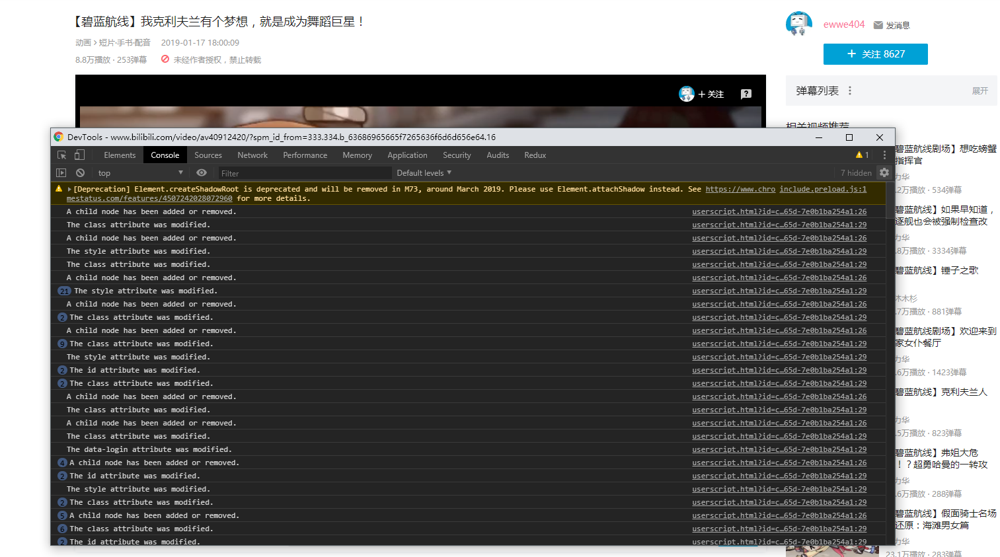
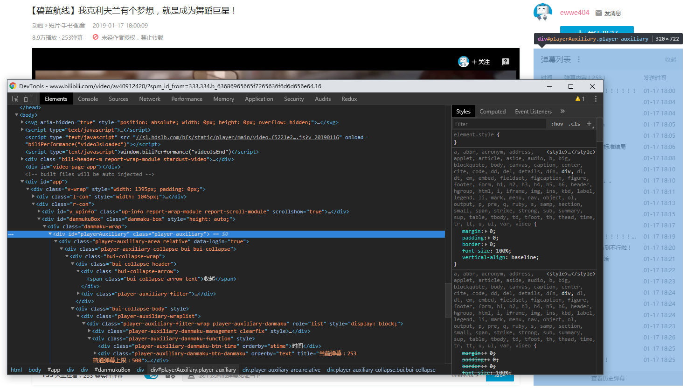
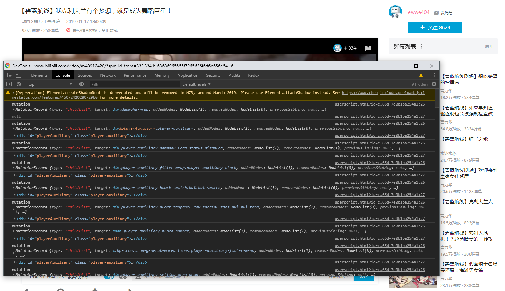
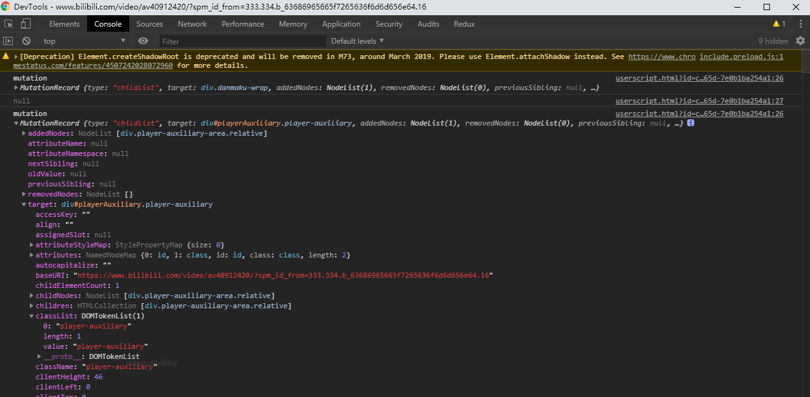
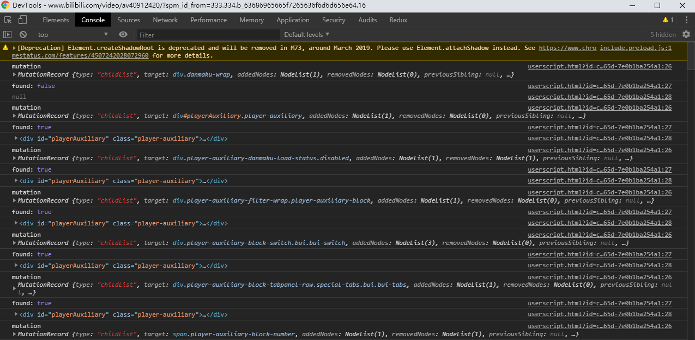

最近在用哔哩哔哩新版播放器的时候感觉十分别扭，侧边有广告，弹幕列表，由于习惯了旧版的默认展开个人不太习惯新版的，就开始打算写一个隐藏侧边广告+默认展开弹幕列表的小脚本，但在编写过程中并不顺利。因为B站他们使用的是SSR做首屏渲染，首次加载的是骨架屏，服务端渲染的弹幕列表只是一个占位的div，并没有任何内容，随着后续的客户端渲染才慢慢加载DOM元素，但是这到底要怎么做才能去监听它DOM变化到渲染出弹幕列表div的时候呢？随后我习惯性地使用了google去搜索相关的方案，然后找到了一个监听DOM树更改的API - MutationObserver。

MutationObserver这个API是用来监听DOM变动的，DOM发生的任何变动，比如结点的增减、属性的变动、文本内容的变动都可以从这个API上得到通知。它跟事件很接近，但是它跟事件有一个本质的不同点是:事件是同步触发的，即DOM变动立马触发相应事件，而MutationObserver是异步触发的，DOM变动不会立马触发，而要等到所有DOM操作结束后才触发，这样的设计可以应付DOM频繁的变动。

MutationObserver API的特点:
1. 异步触发，等所有DOM操作结束后才触发。
2. 把DOM变动记录封装成一个数组处理，而不是一条条个别处理DOM变动。
3. 它可以观察DOM的所有类型的变动，也可以指定只观察某一类变动。

下面用MDN文档下MutationObserver 的示例代码来展示一下这个API的实际效果，首先我们尝试监听哔哩哔哩新版播放器的 `div.danmaku-wrap` ，暂时先移除`observer.disconnect()`方法，然后在tampermonkey下添加脚本，代码如下:
```js
(function () {
  'use strict';
  // 被观察的目标节点
  const targetNode = document.querySelector('.danmaku-wrap');

  // observer选项
  const config = { attributes: true, childList: true, subtree: true };

  // 目标dom发生变动时执行的回调函数
  const callback = function(mutationsList) {
    for(let mutation of mutationsList) {
      if (mutation.type == 'childList') {
        console.log('A child node has been added or removed.');
      }
      else if (mutation.type == 'attributes') {
        console.log('The ' + mutation.attributeName + ' attribute was modified.');
      }
    }
  };

  // 实例化观察者
  const observer = new MutationObserver(callback);

  // 开始观察
  observer.observe(targetNode, config);
})();
```
此时，随意在b站打开一个视频，并确保播放器切换到新版的情况下，用`cmd/ctrl + shift + j` 打开控制台，等待`div.damaku-wrap`渲染后会看到以下输出:


由于以上代码设置了监听元素style跟DOM树元素增删变化，所以会看到关于两者变化的相关输出动作，这些动作都存放在mutationList数组里。

但是，又到底怎么样才知道弹幕列表里面的内容div被渲染呢？

接下来我们修改下代码，只监听元素节点变动：
```js
(function () {
  'use strict';
  // 被观察的目标节点
  const targetNode = document.querySelector('.danmaku-wrap');

  // observer选项
  const config = { childList: true, subtree: true };

  // 目标dom发生变动时执行的回调函数
  const callback = function(mutationsList) {
    for(let mutation of mutationsList) {
      console.log('mutation', mutation);
    }
  };

  // 实例化观察者
  const observer = new MutationObserver(callback);

  // 开始观察
  observer.observe(targetNode, config);
})();
```

继续刷新页面，等待输出。输出结果如下:


此时我们可以看到每次DOM结点变动的详细信息，但是我们又该怎么知道到底什么时候才渲染出弹幕列表(-_-)ゞ？

此时我们使用了`Chrome Dev Tools` 的 `Inspector` 找到了弹幕列表body的相应元素`div.bui-collapse-body`。

好了，现在找到了主要目标，但是接下来又该怎么做？

我们再次修改代码，此时我们主要是看在这个变动列表里面，何时才会渲染出`div.player-auxiliary`。
```js
(function () {
  'use strict';
  // 被观察的目标节点
  const targetNode = document.querySelector('.danmaku-wrap');

  // observer选项
  const config = { childList: true, subtree: true };

  // 实例化观察者
  const callback = function(mutationsList) {
    for(let mutation of mutationsList) {
      console.log('mutation', mutation);
      console.log(document.querySelector('.player-auxiliary'))
    }
  };

  // 实例化观察者
  const observer = new MutationObserver(callback);

  // 开始观察
  observer.observe(targetNode, config);
})();
```

再次刷新，我们从控制台可以看出来，在第二次dom变动的时候渲染出了`div.player-auxiliary`。

但并不是永远是第二次，在我调试的时候，有视频选集的页面可能并不会是第二次，所以我们继续寻找线索。

展开第二次输出的信息，我们把`player-auxiliary`字符串以及它是`class`作为线索，轻易的找到了它所在的位置：

它就在`mutation.target.classList`里，此时使用value属性做判断条件比较简单，再次修改下代码：
```js
(function () {
  'use strict';
  // 被观察的目标节点
  const targetNode = document.querySelector('.danmaku-wrap');

  // observer选项
  const config = { childList: true, subtree: true };

  // Callback function to execute when mutations are observed
  const callback = function(mutationsList) {
    for(let mutation of mutationsList) {
      console.log('mutation', mutation);
      console.log('find dom', mutation.target.classList.value.includes('player-auxiliary'));
      console.log(document.querySelector('.player-auxiliary'))
    }
  };

  // 实例化观察者
  const observer = new MutationObserver(callback);

  // 开始观察
  observer.observe(targetNode, config);
})();
```

我们再回来看看 console ，发现自从找到它之后，每次都会输出true。

该如何避免频繁的判断?

此时借助flag，当flag为true后就不再输出found。来让它找到之后就不再执行。
```js
(function () {
  'use strict';
  // 被观察的目标节点
  const targetNode = document.querySelector('.danmaku-wrap');

  // observer选项
  const config = { childList: true, subtree: true };

  // 目标dom发生变动时执行的回调函数
  const callback = function(mutationsList) {
    let flag;
    for(let mutation of mutationsList) {
      console.log('mutation', mutation);
      if (!flag &&
        mutation.target.classList.value.includes('player-auxiliary')) {
        console.log('find dom', mutation.target.classList.value.includes('player-auxiliary'));
        flag = true;
      }
      console.log(document.querySelector('.player-auxiliary'))
    }
  };

  // 实例化观察者
  const observer = new MutationObserver(callback);

  // 开始观察
  observer.observe(targetNode, config);
})();
```
从输出结果可以看出found现在找到之后就不再执行了。


最后，实现弹幕列表自动展开这功能就很简单了，只需要在if 判断里面执行 弹幕列表 header 的click事件即可。代码整理一下，最终的函数如下。
```js
(function () {
  'use strict';
  // 简单地抽离一下querySelector函数
  const selector = (selector) => document.querySelector(selector);

  // 被观察的目标节点
  const targetNode = selector('.danmaku-wrap');

  // 目标dom发生变动时执行的回调函数
  const config = { childList: true, subtree: true };

  // 判断是否找到弹幕列表(是否加载出来)
  const findDom = (target) => {
    return target.classList.value.includes('player-auxiliary');
  }

  // 实例化观察者
  const callback = function(mutationsList) {
    let flag;
    for(let mutation of mutationsList) {
      const target = mutation.target;
      if (!flag && findDom(target)) {
        // 找到后触发弹幕列表标题点击事件
        selector('.bui-collapse-header').click();
        flag = true;
        // 停止观察
        observer.disconnect();
      }
    }
  };

  // 实例化观察者
  const observer = new MutationObserver(callback);

  // 开始观察
  observer.observe(targetNode, config);
})();
```

参考:
> [MDN文档MutationObserver API](https://developer.mozilla.org/zh-CN/docs/Web/API/MutationObserver)
> [Javascript 标准参考教程 - Mutation Observer API](http://javascript.ruanyifeng.com/dom/mutationobserver.html)